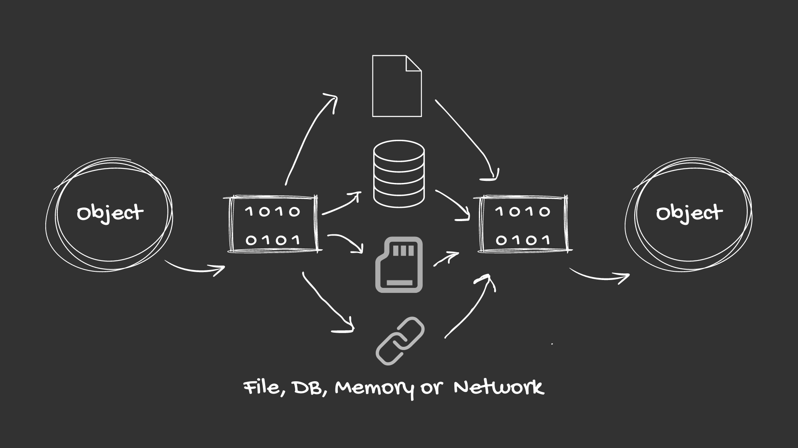

## Serialization in Java

Serialization is a process by which you can save the state of an object to a byte stream. This byte stream can then be saved to a file or sent over a network and later deserialized back into an object. The primary purpose of serialization is to persist an object's state for later retrieval or to transfer objects between different systems.



### How to Serialize an Object

In Java, the `java.io.Serializable` interface is used to indicate that a class can be serialized. This interface has no methods and is used as a marker for the compiler.

Here's an example of a serializable class:

```java
import java.io.Serializable;

public class Person implements Serializable {
    private String name;
    private int age;

    public Person(String name, int age) {
        this.name = name;
        this.age = age;
    }

    public String getName() {
        return name;
    }

    public int getAge() {
        return age;
    }
}
```

In the above example, the `Person` class implements the `Serializable` interface. This means that you can create instances of the `Person` class and serialize them.

### ObjectOutputStream and ObjectInputStream

To serialize an object, you'll need to use the `ObjectOutputStream` class. This class is used to write objects to a byte stream. You can then write the byte stream to a file or send it over a network.

Here's an example of how to serialize a `Person` object:

```java
import java.io.*;

public class SerializationDemo {
    public static void main(String[] args) {
        Person person = new Person("John", 30);

        try (ObjectOutputStream out = new ObjectOutputStream(new FileOutputStream("person.ser"))) {
            out.writeObject(person);
        } catch (IOException e) {
            e.printStackTrace();
        }
    }
}
```

In the above example, we create a `Person` object and then write it to a file called `person.ser` using the `ObjectOutputStream` class.

### Deserialization

Deserialization is the process of converting a byte stream back into an object. This is useful when you want to retrieve an object's state from a file or receive an object over a network.

To deserialize an object, you'll need to use the `ObjectInputStream` class. This class is used to read objects from a byte stream.

Here's an example of how to deserialize a `Person` object:

```java
import java.io.*;

public class DeserializationDemo {
    public static void main(String[] args) {
        try (ObjectInputStream in = new ObjectInputStream(new FileInputStream("person.ser"))) {
            Person person = (Person) in.readObject();
            System.out.println("Name: " + person.getName());
            System.out.println("Age: " + person.getAge());
        } catch (IOException | ClassNotFoundException e) {
            e.printStackTrace();
        }
    }
}
```

In the above example, we read the `Person` object from the file `person.ser` using the `ObjectInputStream` class and then print out its name and age.

### Serialization and Deserialization of Collections

Java collections can also be serialized and deserialized. However, there is one important consideration: all elements of the collection must be serializable. If any element is not serializable, you'll get a `java.io.NotSerializableException` when you try to serialize the collection.

Here's an example of how to serialize and deserialize a `List` of `Person` objects:

```java
import java.io.*;
import java.util.ArrayList;
import java.util.List;

public class SerializationDemo {
    public static void main(String[] args) {
        List<Person> people = new ArrayList<>();
        people.add(new Person("John", 30));
        people.add(new Person("Jane", 25));

        try (ObjectOutputStream out = new ObjectOutputStream(new FileOutputStream("people.ser"))) {
            out.writeObject(people);
        } catch (IOException e) {
            e.printStackTrace();
        }

        try (ObjectInputStream in = new ObjectInputStream(new FileInputStream("people.ser"))) {
            List<Person> restoredPeople = (List<Person>) in.readObject();
            for (Person person : restoredPeople) {
                System.out.println("Name: " + person.getName());
                System.out.println("Age: " + person.getAge());
            }
        } catch (IOException | ClassNotFoundException e) {
            e.printStackTrace();
        }
    }
}
```

In the above example, we create a `List` of `Person` objects, serialize it to a file called `people.ser`, and then deserialize it back into a `List` of `Person` objects.

### Serialization and Deserialization of Arrays

Arrays can also be serialized and deserialized in a similar way to collections. All elements of the array must be serializable.

Here's an example of how to serialize and deserialize an array of `Person` objects:

```java
import java.io.*;

public class SerializationDemo {
    public static void main(String[] args) {
        Person[] people = {new Person("John", 30), new Person("Jane", 25)};

        try (ObjectOutputStream out = new ObjectOutputStream(new FileOutputStream("people.ser"))) {
            out.writeObject(people);
        } catch (IOException e) {
            e.printStackTrace();
        }

        try (ObjectInputStream in = new ObjectInputStream(new FileInputStream("people.ser"))) {
            Person[] restoredPeople = (Person[]) in.readObject();
            for (Person person : restoredPeople) {
                System.out.println("Name: " + person.getName());
                System.out.println("Age: " + person.getAge());
            }
        } catch (IOException | ClassNotFoundException e) {
            e.printStackTrace();
        }
    }
}
```

In the above example, we create an array of `Person` objects, serialize it to a file called `people.ser`, and then deserialize it back into an array of `Person` objects.

### Customizing Serialization

By default, all non-static and non-transient fields of a serializable class are serialized. If you need to customize the serialization process, you can provide your own `writeObject()` and `readObject()` methods in your class. These methods will be called during serialization and deserialization, respectively.

Here's an example of how to customize the serialization process for the `Person` class:

```java
import java.io.*;

public class Person implements Serializable {
    private String name;
    private int age;

    public Person(String name, int age) {
        this.name = name;
        this.age = age;
    }

    public String getName() {
        return name;
    }

    public int getAge() {
        return age;
    }

    private void writeObject(ObjectOutputStream out) throws IOException {
        // Customize the serialization process
        out.writeObject(name);
        out.writeInt(age);
    }

    private void readObject(ObjectInputStream in) throws IOException, ClassNotFoundException {
        // Customize the deserialization process
        name = (String) in.readObject();
        age = in.readInt();
    }
}
```

In the above example, we provide our own `writeObject()` and `readObject()` methods in the `Person` class to customize the serialization and deserialization process. In the `writeObject()` method, we write the name and age fields to the ObjectOutputStream, and in the `readObject()` method, we read the name and age fields from the ObjectInputStream.

Serialization in Java is used in various real-time scenarios:

1. **Storing Object State**: Serialization is used to store the state of an object to a file or a database. This is useful when you want to persist the state of an object for later use, such as saving game progress, user preferences, or application settings.

2. **Network Communication**: Serialization is used to transfer objects between different Java Virtual Machines (JVMs) over a network. This is commonly used in client-server applications, where objects are serialized on the client side and sent to the server, which then deserializes them.

3. **Caching**: Serialization is used in caching mechanisms to store and retrieve complex data structures from a cache. This helps in reducing the load on the database and improving the performance of the application.

4. **Session Management**: Serialization is used in web applications to manage user sessions. The session data, which includes user-specific information, is serialized and stored in cookies or on the server, and deserialized when needed.

5. **Message Passing**: Serialization is used in message-passing systems, such as Java Message Service (JMS), where objects are serialized and sent as messages to be processed by other components or systems.

6. **Data Sharing**: Serialization is used in distributed computing environments, where objects are serialized and sent between different nodes in the system to share data and perform computations.

7. **Object Persistence**: Serialization is used in object-relational mapping (ORM) frameworks, such as Hibernate, to persist Java objects to a relational database.

8. **Remote Method Invocation (RMI)**: Serialization is used in RMI to pass objects between a client and a server in a distributed computing environment.

9. **JavaBeans Components**: Serialization is used in JavaBeans components to save and restore the state of the component.

10. **Java Database Connectivity (JDBC)**: Serialization is used in JDBC to store and retrieve objects from a database.
